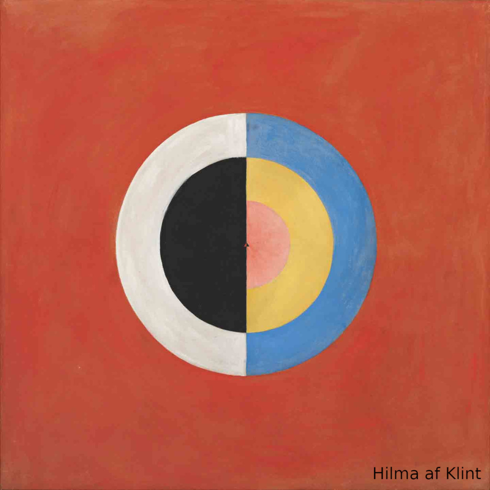

[](https://github.com/sponsors/patriciogonzalezvivo)


Hilma is 3D geometry library in C++ with Python bindings (with support for Numpy) ready to be embed into your projects. 

Dependencies:

* CMake, Swig and Python3
* [GLM](https://github.com/g-truc/glm) required
* [OpenImageDenoise](https://github.com/OpenImageDenoise/oidn) optional


## Compile and install Hilma

1. Before compiling install dependencies:

```bash
// In linux
sudo apt install libglm-dev cmake swig python3-numpy  

// In MacOS
brew install glm cmake swig
brew install --build-from-source open-image-denoise
```

2. Then compile

```bash
mkdir build
cd build
cmake ..
make
sudo make install 
```

**Note**: to install inside anaconda do:
```bash
swig -c++ -python hilma.i
/anaconda3/bin/./python3.7 setup.py build_ext --inplace
/anaconda3/bin/./python3.7 setup.py install 
```

## Hilma as C++ lib

Alternatively to installing Hilma on your system you can easily copy the content of `include/` and `src/` folder to your project, just make sure you 


```cpp
#include "hilma/types/Mesh.h"
#include "hilma/io/ply.h"

int main(int argc, char **argv) {

    float vertices[][2] = { {-1.0, -1.0} , {-1.0, 1.0} , {1.0, 1.0}, {1.0, -1.0} };
    int indices[][3] = { {1, 0, 3}, {1, 3, 2 } };

    hilma::Mesh mesh;
    mesh.addVertices( &vertices[0][0], 4, 2);
    mesh.addIndices( &indices[0][0], 2, 3);
    hilma::savePly("rect.ply", mesh, false);

    return 1;
}
```

## Hilma as Python module

First you need to create the package and install it

```bash
sudo apt install swig
make install
```

Then you can use it as follow:

```python

from hilma import Mesh, savePly

mesh = Mesh()
mesh.addVertices( [ [-1.0, -1.0], [-1.0, 1.0], [1.0, 1.0], [1.0, -1.0] ] )
mesh.addIndices( [( 1, 0, 3 ), (1, 3, 2)] ) 
savePly("rect.ply", mesh, False)

```

# Acknowledgements 

Some of the code is based on:

* [OpenFrameworks](https://openframeworks.cc/) `ofMesh` and `ofPolyline`
* [Mapbox's Earcut tessellator](https://github.com/mapbox/earcut)
* [Tangram-es's ployline to spline converter](https://github.com/tangrams/tangram-es/blob/master/core/src/util/builders.cpp)
* [Dan Wilcox's swig wrapper for GLM](https://github.com/danomatika/swig-openframeworks)
* [Dimitri Diakopoulos' TinyPly](https://github.com/ddiakopoulos/tinyply)
* [Syoyo Fujita's TinyGltf](https://github.com/syoyo/tinygltf)
* [Syoyo Fujita's TinyObj loader](https://github.com/tinyobjloader/tinyobjloader)
* [Peter Shirley's Ray Tracing in One Weekend ](https://raytracing.github.io/books/RayTracingInOneWeekend.html)
* [Ray/Triangle intersection](https://www.scratchapixel.com/lessons/3d-basic-rendering/ray-tracing-rendering-a-triangle)
* [Michael Fogleman's Heightmap meshing utility](https://github.com/fogleman/hmm)
* [Felzenszwalb page at Brown University for Image to SDF](https://cs.brown.edu/people/pfelzens/dt/)

# License

Hilma is open source. You may use, extend, and redistribute without charge under the terms of the [BSD license](LICENSE).

```
Copyright (c) 2020, Patricio Gonzalez Vivo
All rights reserved.

Redistribution and use in source and binary forms, with or without modification, 
are permitted provided that the following conditions are met:

1. Redistributions of source code must retain the above copyright notice, this
list of conditions and the following disclaimer.

2. Redistributions in binary form must reproduce the above copyright notice, this
list of conditions and the following disclaimer in the documentation and/or other
materials provided with the distribution.

THIS SOFTWARE IS PROVIDED BY THE COPYRIGHT HOLDERS AND CONTRIBUTORS "AS IS" AND 
ANY EXPRESS OR IMPLIED WARRANTIES, INCLUDING, BUT NOT LIMITED TO, THE IMPLIED 
WARRANTIES OF MERCHANTABILITY AND FITNESS FOR A PARTICULAR PURPOSE ARE DISCLAIMED. 
IN NO EVENT SHALL THE COPYRIGHT HOLDER OR CONTRIBUTORS BE LIABLE FOR ANY DIRECT, 
INDIRECT, INCIDENTAL, SPECIAL, EXEMPLARY, OR CONSEQUENTIAL DAMAGES (INCLUDING, 
BUT NOT LIMITED TO, PROCUREMENT OF SUBSTITUTE GOODS OR SERVICES; LOSS OF USE, 
DATA, OR PROFITS; OR BUSINESS INTERRUPTION) HOWEVER CAUSED AND ON ANY THEORY OF 
LIABILITY, WHETHER IN CONTRACT, STRICT LIABILITY, OR TORT (INCLUDING NEGLIGENCE 
OR OTHERWISE) ARISING IN ANY WAY OUT OF THE USE OF THIS SOFTWARE, EVEN IF ADVISED OF
THE POSSIBILITY OF SUCH DAMAGE.
```
